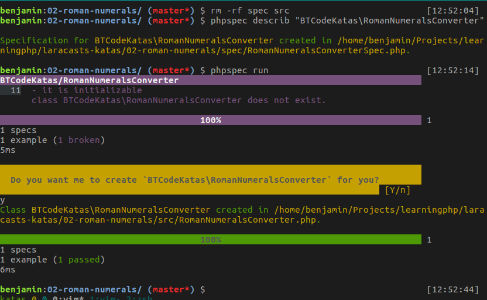

# Roman Numerals Code Kata

For this round of learning I wanted to make use of a custom namespace. This was a little trickier to setup with `phpspec` so that it autoloads the classes correctly and generates the spec and class files in the correct location. The main steps are:

* Set the `psr-4` prefix in `composer.json`
* Create a file called `phpspec.yml` wherever `phpspec` is usually run (typically the project root)
* Define the `namespace` and `psr-4` values in the `phpspec.yml` file

For this kata I used the namespace `BTCodeKatas`, so the above looks like:

```
// composer.json
...
"autoload": {
	"psr-4": {
		"BTCodeKatas\\": "src/"
	}
}
...

// phpspec.yml
suites:
    main:
        namespace: BTCodeKatas
        psr4_prefix: BTCodeKatas
```

Once these project settings are created, we can create the spec and class files by using:

```
phpspec describe BTCodeKatas/RomanNumeralsConverter
phpspec run
```


